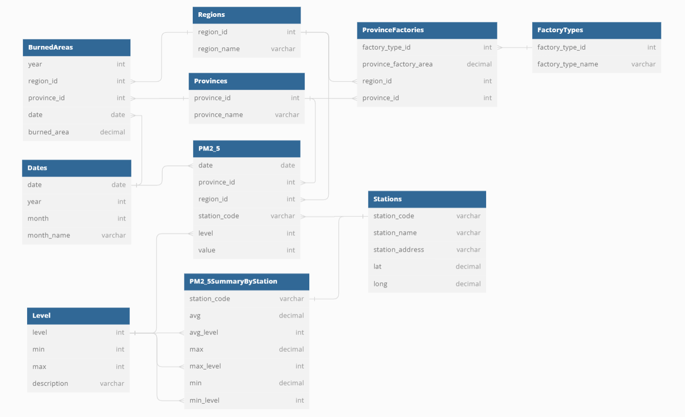
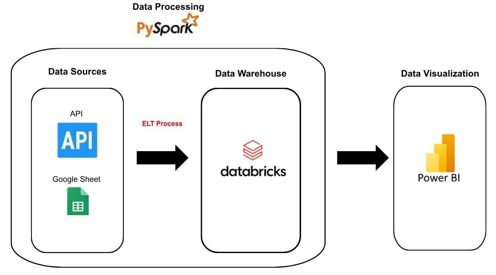

# Build Data Analysis Pipeline for PM2.5 in Thailand

**Table of Contents**

* [Project Document](#project-document)
* [Problem](#problem)
* [Datasets](#datasets)
* [Data Modeling](#data-modeling)
* [Data Dictionary](#data-dictionary)
* [Data Pipeline](#data-pipeline)
* [Technologies](#technologies)
* [Dashboard](#dashboard)
* [Files and What They Do](#files-and-what-they-do)
* [Instruction on Running the Project](#instruction-on-running-the-project)

## Project Document
[Go To Project Document](https://docs.google.com/document/d/1dCnek2Kl9YsPJZxKuAzpLUOfrXD9gWWcaM2maEY4A6g/edit)

## Problem

PM2.5 หรือชื่อเต็มคือ Particulate Matter with diameter of less than 2.5 micron เป็นฝุ่นละอองขนาดจิ๋วที่มีขนาดไม่เกิน 2.5 ไมครอน ซึ่งมีขนาดประมาณ 1 ใน 25 ส่วนของเส้นผ่าศูนย์กลางเส้นผมมนุษย์ โดยมีขนาดเล็กจนขนจมูกของมนุษย์ที่ทำหน้าที่กรองฝุ่นนั้นไม่สามารถกรองได้ จึงทำให้ฝุ่น PM2.5 สามารถแพร่กระจายเข้าสู่ทางเดินหายใจ กระแสเลือด และเข้าสู่อวัยวะอื่นๆ ในร่างกายได้

PM2.5 ได้เริ่มมีบทบาทในประเทศไทยอย่างมากในช่วงต้นปี 2562 ในตอนนั้นประเทศไทยประสบกับสภาวะฝุ่นปกคลุมอย่างหนาแน่น ทำให้ทุกภาคส่วนทั้งรัฐบาล เอกชน ตลอดจนประชาชน ล้วนให้ความสนใจเป็นอย่างมากพร้อมกับหาคำตอบว่าเกิดอะไรขึ้น จนสุดท้ายก็ทำให้เราทุกคนได้รู้จักกับค่าฝุ่น PM2.5 นี้ นับตั้งแต่นั้นมาจึงมีการตรวจวัดปริมาณค่าฝุ่น PM2.5 ตามจุดบริเวณต่างๆ ของประเทศไทย เพื่อตรวจสอบว่าเป็นอันตรายต่อสุขภาพหรือไม่

PM2.5 สามารถเกิดขึ้นได้จากหลายปัจจัย ทั้งจากกระบวนการผลิตในโรงงานอุตสาหกรรม จากการเผาไหม้ในกิจกรรมในครัวเรือน จากการเผาทางการเกษตร จากการเผาป่า จาการการจราจร รวมถึงสาเหตุอื่น เช่น การรวมตัวของก๊าซอื่นๆ ในบรรยากาศ 

ด้วยเหตุนี้ทำให้ทางกลุ่มของเรามีความสนใจที่จะศึกษาเกี่ยวกับแนวโน้มของปริมาณค่าฝุ่น PM2.5 ในประเทศไทยตามบริเวณต่างๆ รวมถึงต้องการศึกษาว่า ปัจจัยที่ส่งผลต่อแนวโน้มของปริมาณค่าฝุ่น PM2.5 มีลักษณะเด่นเป็นอย่างไรในแต่ละภูมิภาค โดยในโปรเจคนี้ขอทำการศึกษาทั้งหมด 2 ปัจจัย ได้แก่ 1.โรงงานอุตสาหกรรม: พิจารณาจากพื้นที่ของโรงงานอุตสาหกรรมในแต่ละภูมิภาค และ 2.ไฟป่า: พิจารณาพื้นที่ที่เกิดไฟป่าในภูมิภาคนั้นๆ

โดยการใช้งานจริงนั้นคาดว่าสามารถใช้แนวโน้มค่าฝุ่นที่เปลี่ยนไปเป็นตัวชี้วัดคุณภาพการแก้ปัญหาไฟป่าและมาตรการจัดการฝุ่นละอองที่เกิดจากโรงงานอุตสาหกรรมในแต่ละภูมิภาคหรือระดับจังหวัด

## Datasets

* ข้อมูล PM2.5 ในประเทศไทย
    [Air4Thai: Regional Air Quality and Situation Reports](http://www.air4thai.com/webV3/#/History) 
* ข้อมูลไฟป่าในประเทศไทย
    [Digital Government Development Agency:  Open Government Data of Thailand](https://data.go.th/dataset/gdpublish-fire1) 
* ข้อมูลโรงงานอุตสาหกรรมในประเทศไทย
    [Department of Industrial Works:  บัญชีประเภทโรงงานอุตสาหกรรม](https://www.diw.go.th/datahawk/factype.php)
    [Department of Industrial Works:  พื้นที่โรงงานอุตสาหกรรม](https://www.diw.go.th/datahawk/factype.php)

## Data Modeling

การออกแบบ Data Model ของเรา จะอ้างอิงจากปัญหาที่เราต้องการวิเคราะห์ โดยเราสนใจข้อมูล PM2.5 ในมิติต่าง ๆ ได้แก่ มุมมองของปี จังหวัด ภาค เครื่องวัด รวมถึงคุณภาพอากาศที่แสดงได้จากระดับของฝุ่น นอกจากนี้ เรายังสนใจแนวโน้มของ PM2.5 ที่อาจเกิดจากปัจจัยอย่างพื้นที่โรงงานอุตสาหกรรมและพื้นที่ไฟป่าในมิติต่าง ๆ เช่นกัน 

ดังนั้น เราจึงเลือกออกแบบ Data Modal แบบ Galaxy Schema ซึ่งเป็นการออกแบบโดยมี Fact table 3 ตาราง แบ่งตามกลุ่ม metrics ที่เราสนใจ ได้แก่ PM2.5 โรงงาน และไฟป่า ซึ่ง Fact table เหล่านี้จะใช้ Dimension รวมกัน โดยเลือกออกแบบในรูปแบบดังกล่าวเนื่องจากต้องการความยืดหยุ่น ที่เหมาะกับชุดข้อมูลหลาย ๆ เรื่อง ซึ่งแต่ละเรื่องมีความเกี่ยวข้องกัน และมี Dimension ที่ร่วมกันด้วย ทำให้เราวิเคราะห์ได้หลากหลาย และยังรองรับในอนาคตหากเราต้องการวิเคราะห์ปัจจัยอื่นเพิ่มขึ้น

## Data Dictionary

### pm2_5

| Name | Type | Description | IsKey |
| - | - | - | - |
| date | date | Measurement date | yes |
| province_id | int | ID of province | yes |
| region_id | int | ID of region | yes |
| station_code | varchar | ID of station | yes |
| level | int | Air quality level | yes |
| value | int | Measured value |

### dates

| Name | Type | Description | IsKey |
| - | - | - | - |
| date | date | Measurement date | yes |
| year | int | Measurement year |
| month | int | Measurement month |
| month_name | varchar | Measurement month's name |

### provinces

| Name | Type | Description | IsKey |
| - | - | - | - |
| province_id | int | ID of province | yes |
| province_name | varchar | Name of province |

### regions

| Name | Type | Description | IsKey |
| - | - | - | - |
| region_id | int | ID of region | yes |
| region_name | varchar | Name of region |

### burned_areas

| Name | Type | Description | IsKey |
| - | - | - | - |
| region_id | int | ID of region | yes |
| province_id | int | ID of province | yes |
| date | date | Measurement date | yes |
| year | int | Measurement year |
| burned_area | decimal | Area of burned in each province |

### province_factories 

| Name | Type | Description | IsKey |
| - | - | - | - |
| factory_type_id | int | ID of factory type | yes |
| region_id | int | ID of region | yes |
| province_id | int | ID of province | yes |
| province_factory_area | decimal | Area of factory in each province |

### factory_types

| Name | Type | Description | IsKey |
| - | - | - | - |
| factory_type_id | int | ID of factory type | yes |
| factory_type_name | varchar | Name of factory type |

### level

| Name | Type | Description | IsKey |
| - | - | - | - |
| level | int | Air quality level | yes |
| min | int | Min of air quality level range |
| max | int | Max of air quality level range |
| description | varchar | Descripton of air quality level |

### stations

| Name | Type | Description | IsKey |
| - | - | - | - |
| station_code | varchar | ID of station | yes |
| station_name | varchar | Name of station |
| station_address | varchar | Address of station |
| lat | decimal | Latitude of station |
| long | decimal | Longitude of station |

### PM2.5SummaryByStation

| Name | Type | Description | IsKey |
| - | - | - | - |
| station_code | varchar | ID of station | yes |
| avg | decimal | Average of pm2.5 value |
| avg_level | int | Air quality level of average pm2.5 value | yes |
| max | decimal | Max of pm2.5 value |
| max_level | int | Air quality level of max pm2.5 value | yes |
| min | decimal | Min of pm2.5 value |
| min_level | int | Air quality level of min pm2.5 value | yes |

## Data Pipeline

## Technologies

* Google Sheet: ใช้สำหรับจัดเก็บข้อมูลที่ใช้ในการเริ่มต้น
* Databricks: ใช้สำหรับเป็น Data Warehouse และ Data Ingestion เพื่อดึงข้อมูล API ตาม schedule ใน workflow อัตโนมัติในแต่ละวัน
* PySpark: ใช้สำหรับการประมวลผลข้อมูล
* Power BI:  ใช้สำหรับเป็น BI Tool

## Dashboard
[Go To Dashboard](https://app.powerbi.com/links/ivZ5SWlCVO?ctid=f90c4647-886f-4b4c-b2eb-555df9ec4e81&pbi_source=linkShare)

  
## Files and What They Do

| Name | Description |
| ------- | --------------- |
| `README.md` | README file that provides discussion on this project |
| `data-api-upsert.py` | This file is the Python notebook that uses to create table, create view, insert data, and rest API in daily |
| `google_sheet_link.txt` |  This file contained Google Sheet link that will be used when start the project |

## Instruction on Running the Project
[Go To Instruction](https://docs.google.com/document/d/1-7AHIKPvSPIHpQUK3y93g01lnmfENmwaGRHWCNlyhu0/edit)

